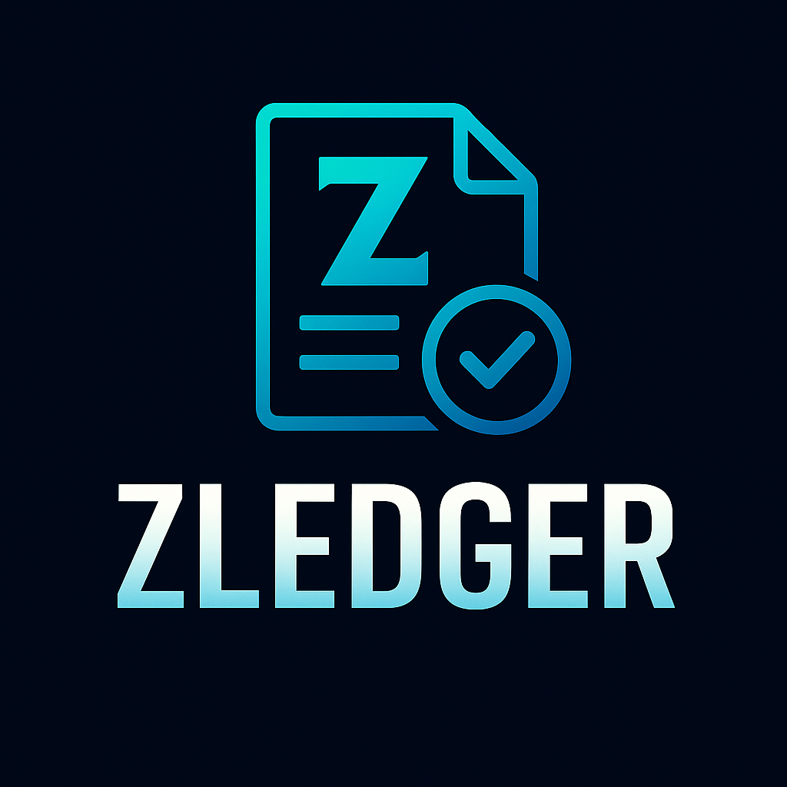

<div align="center">
  
</div>

# Zledger: A Lightweight Ledger Engine in Zig

[](https://ziglang.org/)
[](https://github.com/ziglang/zig)
[](https://en.wikipedia.org/wiki/Ledger)
[](https://en.wikipedia.org/wiki/Double-entry_bookkeeping)
[](https://ed25519.cr.yp.to/)
[](https://en.wikipedia.org/wiki/SHA-2)
[]()

---

## 📌 Overview

**Zledger** is a lightweight, performant, and embeddable ledger engine built in Zig. It's designed for use in financial applications, cryptocurrency accounting, blockchain wallets, and local transactional systems where performance and precision matter.

Zledger aims to provide the foundational infrastructure for secure balance tracking, transaction journaling, double-entry accounting, audit-ready systems, and programmable transaction constraints ("covenants")—now built directly into the engine.

---

## 🎯 Goals

* ✅ **Minimal yet powerful ledger engine**
* ✅ **No external dependencies** — just Zig and stdlib
* ✅ **Precision-first with no floating point leakage**
* ✅ **Supports both single and double-entry models**
* ✅ **Transaction chaining + integrity hashing**
* ✅ **Built-in programmable constraints for custom rules**
* ✅ **Cryptographic signing and verification (Zsig fully integrated)**
* ✅ **Built for CLI, WASM, or embedded systems**

---

## 🧱 Core Modules

### 1. `zledger.tx`

Handles creation and serialization of transactions:

```zig
const Transaction = struct {
    id: []const u8,
    timestamp: i64,
    amount: i64,
    currency: []const u8,
    from_account: []const u8,
    to_account: []const u8,
    memo: ?[]const u8,
};
```

### 2. `zledger.account`

Manages accounts and balances. Supports double-entry verification and balance auditing.

### 3. `zledger.journal`

Flat append-only journal to store TX logs with optional integrity hash per transaction.

### 4. `zledger.audit`

Includes tools for integrity checks, balance diffs, and transaction history verification.

### 5. `zledger.rules`

Built-in support for attaching programmable constraints (formerly "covenants") to transactions or accounts:

* Custom transaction validation
* Spending limits (per account, asset, or time)
* Multi-signature/approval flows
* Allow/block lists and KYC enforcement
* Account- or transaction-level hooks for smart contract logic

#### Example: Custom Validation Rule

```zig
const AllowlistRule = struct {
    allowed: [][]const u8,
    pub fn validate(self: @This(), tx: Transaction) !void {
        if (!self.allowed.contains(tx.to_account)) return error.AccountNotAllowed;
    }
};

// Register a rule with the ledger
try zledger.rules.register(AllowlistRule{ .allowed = &[_][]const u8{"acct1", "acct2"} });
```

### 6. `zledger.cli`

A simple CLI interface to run operations:

```sh
zledger tx add --from user1 --to user2 --amount 1000 --memo "Refund"
zledger audit verify
zledger balance user2
```

### 7. `zledger.zsig` (Integrated Zsig)

Cryptographic signing and verification capabilities from the fully integrated Zsig library:

* Ed25519 transaction signing and verification
* Public/private keypair generation and management
* Secure transaction authentication and integrity
* Detached and inline signature support
* Deterministic signing for audit trails
* Challenge-response authentication
* Token and JWT signing capabilities

---

## 🔐 Security & Precision

* Fixed-point arithmetic using `i64` + `DECIMALS` (e.g. cents or micro-units)
* Optional SHA256 for integrity chaining of transactions
* Ed25519 cryptographic signing via integrated Zsig functionality
* No floats, no rounding errors, no surprises
* Programmable constraints prevent invalid or unauthorized transactions

---

## 🧠 Use Cases

* 💸 Embedded wallets (Zwallet)
* 📊 Local double-entry bookkeeping
* 🔐 Personal finance ledger in terminal
* 🌐 WASM-based transaction tracker for web apps
* 🧾 Audit trail system for smart contracts or DAOs
* ⚡ On-ledger programmable rules and constraints

---

## ✅ Recently Integrated

* **Zsig cryptographic signing library fully integrated** with CLI commands:
  - `zledger keygen [--out <keyfile>]` - Generate Ed25519 keypairs
  - `zledger sign --in <file> --key <keyfile>` - Sign files (implementation ready)
  - `zledger verify --in <file> --sig <sigfile>` - Verify signatures (implementation ready)

## 🛠 Future Extensions

* Plugin hooks for syncing with Zwallet
* Zcash-style memo field support
* Export formats: CSV, JSON, and Merkle-tree snapshots
* Pluggable scripting/interpreter for advanced rule logic

---

## 🌍 License

MIT — Lightweight, auditable, and hacker-friendly.

---

